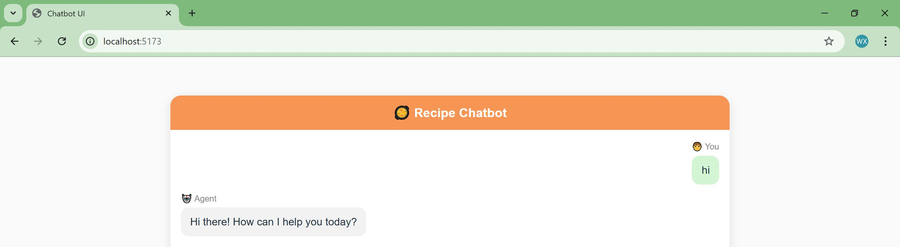
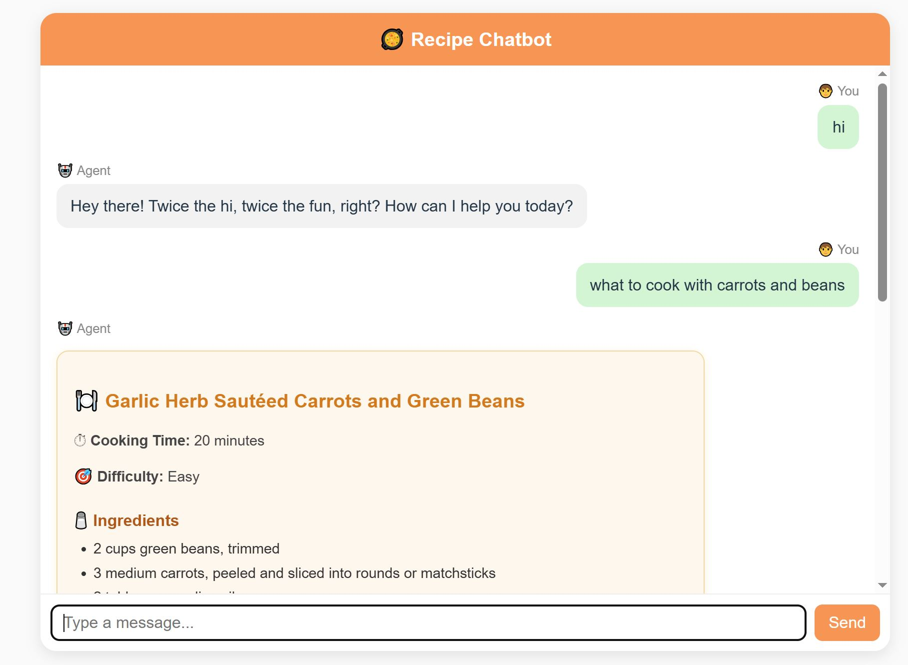

## Simple Application with React Frontend and FastAPI Backend

## Getting Started

### Step 0: Install Node.js and create app folder

#### Install node.js, follow steps documented here:
- https://nodejs.org/en/download/current

#### To create app folder:
```
npx create-react-app my-cooking-app (deprecated)
npm create vite@latest my-cooking-app
```
- Source: https://www.zignuts.com/blog/create-react-app-alternatives#:~:text=For%20years%2C%20Create%2DReact%2D,React%20community%20is%20moving%20on.

#### Install required packages
```
python -m venv venv
pip install -r requirements.txt
```

### Step 1: In terminal 1, run the FastAPI backend
```
.\venv\Scripts\activate
cd my-cooking-app\backend
uvicorn main:app --reload --port 8000
```

### Step 2: In terminal 2, run the React app
```
cd my-cooking-app
npm run dev
```

## App Demo
Chat is available at http://localhost:5173/


Interacting with the app
